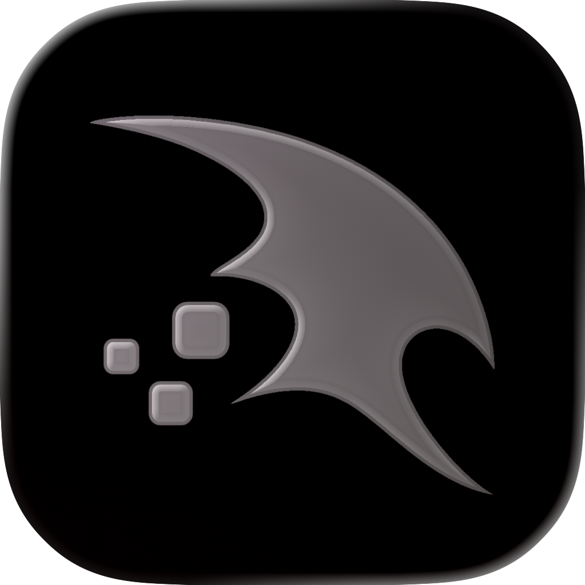
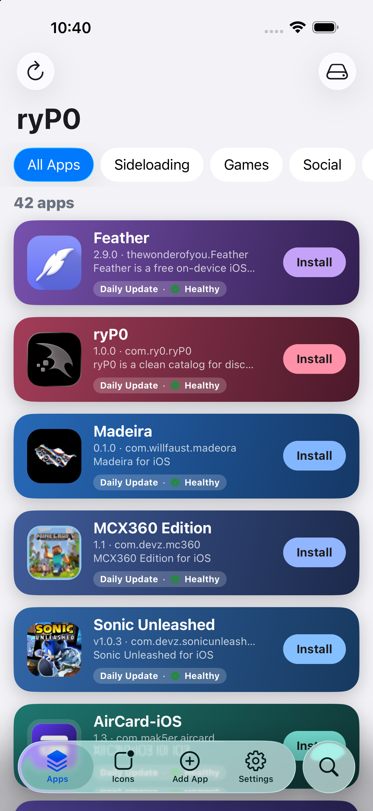
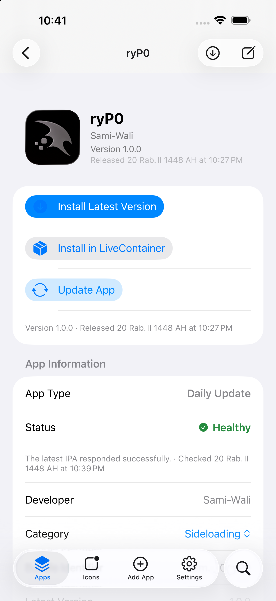
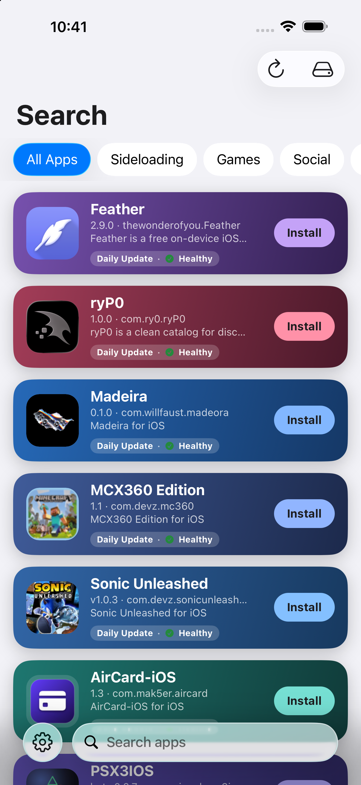

<div align="center">

<br>



# ryP0

### Discover beyond the usual.

A clean catalog for discovering independent iOS software,  
community releases, projects, and sources.

<br>

[](https://github.com/Sami-Wali/ryP0/releases/latest)
[](https://github.com/Sami-Wali/ryP0/releases)
[](#compatibility)

<br>

[**Get ryP0**](https://github.com/Sami-Wali/ryP0/releases/latest)
&nbsp;&nbsp;•&nbsp;&nbsp;
[**Open Catalog**](https://altdirect.app/)
&nbsp;&nbsp;•&nbsp;&nbsp;
[**Releases**](https://github.com/Sami-Wali/ryP0/releases)

<br><br>

</div>

---

<p align="center">
  
</p>

---

## Explore differently

ryP0 brings independent iOS software, projects, releases, and sources together in one simple interface.

Instead of searching through different repositories and release pages manually, ryP0 organizes available software into a clean and accessible catalog.

It is designed around simplicity, transparency, and direct access to original sources.

---

## What is ryP0?

ryP0 is a catalog-based platform for exploring software distributed through independent sources.

Each entry can include information such as:

- Name and icon
- Version
- Description
- Developer
- Release information
- Source
- Download availability
- Update information

ryP0 keeps everything organized while preserving direct access to the original project or distribution source.

---

## Preview

<p align="center">
  
  &nbsp;
  
  &nbsp;
  
</p>

---

## Discover

Explore software from different independent sources through one organized catalog.

Find new projects, view release information, check available versions, and access original sources without jumping between multiple repositories.

---

## Sources first

ryP0 is built around publicly available project information and release sources.

Where available, entries can provide direct access to:

- Original developer
- Project repository
- Release page
- Distribution source
- Version history

This keeps the experience transparent and makes it easy to understand where each release comes from.

---

## Releases

Public ryP0 builds are distributed through GitHub Releases.

### Latest release

[**Get the latest ryP0 release →**](https://github.com/Sami-Wali/ryP0/releases/latest)

Previous versions can be found on the:

[**ryP0 Releases page →**](https://github.com/Sami-Wali/ryP0/releases)

---

## LiveContainer

ryP0 can be used alongside LiveContainer for a smoother workflow.

> [!TIP]
> ### Recommended setup for LiveContainer users
>
> If you use **LiveContainer 1 and LiveContainer 2**, it is recommended to convert **ryP0 into a Shared App**.
>
> This allows you to run **ryP0 inside LiveContainer 2** while keeping **LiveContainer 1** available as your primary container.
>
> With this setup, ryP0 can remain open in LiveContainer 2 while compatible software can be sent to or opened with LiveContainer 1.

### Setup

In your primary LiveContainer:

1. Find **ryP0**
2. Open its app settings
3. Choose **Convert to Shared App**
4. Open **LiveContainer 2**
5. Launch the shared ryP0 instance from LiveContainer 2

You can then use ryP0 from LiveContainer 2 while keeping LiveContainer 1 available for compatible downloads and launches.

> [!NOTE]
> Exact behavior may depend on your LiveContainer version and configuration.

---

## Catalog

ryP0 uses a structured public catalog to retrieve software metadata, versions, releases, and source information.

### Catalog URL

```text
https://raw.githubusercontent.com/Sami-Wali/ryP0-repository/main/repo.json
